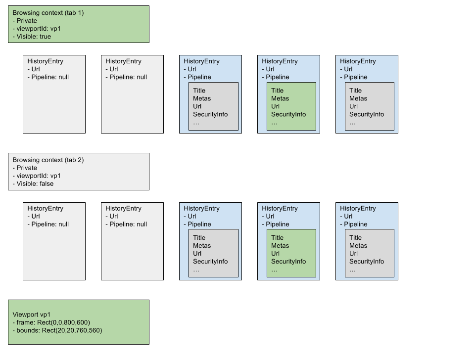

The initial motivation is to improve Mozilla's [Browser API](https://developer.mozilla.org/en-US/docs/Web/API/Using_the_Browser_API), which is a set of extra methods, property and events on top of the DOM `<iframe>` element (mozbrowser). After experimenting with Gecko's and Servo's implementation of the the Browser API, and Electron's `<webview>`, we started drafting a potential V2 of the API.

This project is an attempt to put together a multi-purpose low level API that could be used to embed and control Servo.

Consumers of this API would be:
- a JS library that would make it easy to build a browser in HTML (think [Mozilla's Browser API](https://developer.mozilla.org/en-US/docs/Web/API/Using_the_Browser_API) or [Electron's Webview](https://github.com/electron/electron/blob/master/docs/api/web-contents.md))
- A [WebDriver](https://www.w3.org/TR/webdriver/) implementation
- A [WebExtension](https://developer.chrome.com/extensions) implementation
- Developer tools

This low level API will be initially described with WebIDL, but we don't think this API should be restricted only to JavaScript/DOM consumers.

This low level API covers only **Servo <-> consumer** communication. The above scenarios also require extra powers, like access to the operating system. This project doesn't address this problematic as it's an orthogonal problem (we usually refer to app level or operating system access as "Runtime).

The main goals of this API are:
- exhaustive. We want it to cover enough that it will suffice for most Servo embedders
- non-blocking
- minimal impact on Servo's internals
- minimal impact on standardised components (unlike the current Browser API that re-use the `<iframe>` element)

**This document is not even a draft. Just unsorted notes.**

## Servo overview

In Servo, documents are also called pipelines. Pipelines contain a set of frames (can be seen as the list of iframes within a document). Frames contain a sorted set of pipelines (these pipelines represent the history entries). Pipelines and frames are referenced via ids. Pipelines and frames live in a constellation, the "Command Control" that passes messages to pipelines.

### pipeline

- internal name for a document within Servo
- where layout, script (& DOM) and rendering happen
- has an id shared between the different components of the engine
- can be **frozen**. Happens for example when the user clicks on a link: a new document is created, the previous document/pipeline is frozen, and ready to be thawed for when the user clicks the back button. No events are supposed to reach a frozen pipeline, the script thread is idle, and rendering doesn't happen anymore.
- can be **not visible**. Happens when the pipeline is not frozen but not on screen (background tab for example). requestAnimationFrame and any animations are paused. Timers (setTimeout/setInterval) are slowed down.
- initially a pipeline is said **pending**, until the document is created
- contains frames

### frame

- equivalent to a [browsing context](https://www.w3.org/TR/html51/browsers.html#sec-browsing-contexts)
- a list of ordered **history entries** representing the history of this browsing context
- `<iframes>` are frames
- top level window is also a frame

### History Entry
- a **history entry** is considered **dead** or **alive** ([WIP in progress in Servo](https://github.com/servo/servo/pull/11893))
- a **alive** entry is a reference to a pipeline
- a **dead** entry was a pipeline that has been purged. Only the URL is saved.
- more about how history works: https://github.com/asajeffrey/ServoNavigation/blob/master/notes/notes.pdf
- the current document is the **active** entry
- warning: purge means deleting the pipeline, not forgetting it (in Browser API v1, purge means forget)

### constellation

- where pipelines live
- a list of all the frames
- a list of all the pipelines

## viewport

- Where web content is drawn. Shared by all the document of a browsing context.
- Maybe shared by all browsing context.
- overscroll
- a static rectangle is not enough (think `<iframe>` and `<webview>`)
- frame (where content is visible) and bounds (viewport as seen from the content)
- think safari dessktop toolbar
- we want to make to possible to animate bounds in the compositor
  - use JS keyframes: https://w3c.github.io/web-animations/#processing-a-keyframes-argument
  - reuse CSS:padding? New CSS property?
  - how do we reconsiliate that with scrolling? Think iOS toolbar scalling
  - see: http://people.mozilla.org/~prouget/scrollIssue.png
- might be where visibility is toggled
- controls focus
- can prevent key events to pass to content
- get preventDefaulted events
- onfirstpaint
- onvisibilitychanged
- https://github.com/browserhtml/browserhtml/issues/355
- Use [CompositorWorker](https://github.com/w3c/css-houdini-drafts/blob/master/composited-scrolling-and-animation/Explainer.md)
  to change content padding and animate things on content scrolling
  - will need to introduce `data.viewport.contentScrollTop|Right|Bottom|Left`
    and use data.viewport.padding to resize content while showing things outside
    of viewport
  - could this work for a non-DOM API?



## Security

- only top level frame's pipelines can have access to this API
- content doesn't need any privilege, and should be sandboxed

## API Considerations

- good developer experience is not an immediate goal. We want 1) build a low level and not DOM-based API that brings as much as we want to the "user land" 2) build a developer-friendly DOM-based API on top of the JS API (See DOM API section)
- better way to trace event origin: get a titleupdate event? We want to be sure which document
  this new title belongs to.
- more granular. Current state of APIs is basically a frame object that has the same property has a pipeline, but these properties need to be updated everytime the user navigate.
- we probably don't want to re-use all the Servo internal names (pipelines?).
- minimal impact on servo's internal. don't want to pollute the spec.
- performance impact?

## Major changes:

- more granular. API gives access to a list of pipelines. A notification is fired when a document becomes active. Up to the client to listen to events from the different pipelines. No more goBack()/goForward(). We activate pipeline.
- Not a DOM level API, first low level, then build DOM level API in J. API as Webidl and Rust traits?
- kill goBack/goForward
- possibility to render a frozen pipeline
  - goBack gestures
  - show history (think safari preview) without screenshots
- no book keeping
- see viewport
- build a full test suite, mock for early experiments

## DOM API

This is for later, but this is the kind of DOM API we want to be able to build on top of the Servo embedding API.

- brings declarativeness
- built on top of low level API, "user land"
- except for viewport frame coordinates (coordinate in the document) which will come from top level document layout
- same for the frozen pipeline rendering
- we will need DOM mutation
- will need to make it clear what is readonly/read-n-write
- events can be cancelled, so we keep event.details, and update the element property once event has succesfuly propagated (if cancelable)
- Event propagation / delegation should be specified. Ex: https://github.com/browserhtml/browserhtml/issues/317
    - forcetouch, escape issue

```html
<viewport width=600 height=400 padding="20 0 0 0">
  <browsingctx visible="true">
    <pipeline pipelineid="" url="">
    <pipeline pipelineid="" url="">
    <pipeline pipelineid="" url="" active="true">
  </browsingctx>
  <browsingctx private="true" contentblocker="true">
    <pipeline pipelineid="" url="">
    <pipeline pipelineid="" url="" active="true">
    <pipeline pipelineid="" url="" preload>
  </browsingctx>
</viewport>
<pipelinemirror pipelineid="3" width=600 height=400 padding="20 0 0 0">

```
The above is just food-for-though. Some issues:
- attribute can't be readonly
- is a DOM hieararchy necessary?
- …

## Web Extensions

The Web Extension API can be implemented by combining:
- This Browser API V2 (script injection, WebRequestManager, browserAction, …)
- some embedder code (for example, tabs management, bookmarks, …)
- runtime code (for example, native windows, part of the WE runtime API, …)

## WebDriver

FIXME
- can we implement webdriver on top of the embedding api?

## Questions:

- Is there a way to reunite the Browser API, webdriver, and webextension, devtools API…
- could we implement the same thing with Gecko? If so, do we want to?
- initialization
  - how to load a new URL?
    - from browsingContext
  - how to create a viewport without a DOM element?
    - low level API is JS only
    - can it be compatible with Rust types?
    - will be platform dependent
- life time between internal pipelines and JS pipelines
- can we create a pipeline ahead of time to preload content?
  - can't be done now
  - will need to be skipped by joint_session
  - doesn't seem to hard to do
- design of window.open and opennewtab?
- How run JS in content? As a worker? How to communicate back? Frame script?
- how to drive chrome animations based on content scroll position?
- are scrollsnapping and srollgrab necessary
- how to context menu
- tweak overscroll
- devtools integration
- sharing setting with content?
- can we set referer/openner when creating a pipeline? Probably not necessary (as pipeline are creatd internally), but would that help in any way?
- how to build extensions like adblock and video download helper?


## Scenarios

[FIXME: GIF of slide animation from Gordon]
@gozala: another neat idea! What if when you click a link on a page we slide current page slightly down and slide new page on top with a progressbar so that your current page is still usable and interactive but once initial load is complete then we slide the previous page out and new page in that’s kind of another use case for having pipeline controls vs just iframe
Paul's note: doesn't really make sense. While pipeline is pending, page will be white. If there's something to draw, the pipeline is already active. We can use the mechanism to render frozen pipeline as way to render the oorigin pipeline.

[FIXME: GIF of gesture animation]
goBack()/goForward() gesture: The user can use gestures to preview the document he might want to go back to
https://github.com/servo/servo/issues/6226

http://fat.gfycat.com/ElatedDistantDrever.mp4
Safari toolbar / previous gecko experiment

[FIXME: gundo screenshot]
[gundo style history](https://github.com/benfrancis/webview/issues/4)
Paul's note: This is an important change. How important is this? What kind of things do we expect to be able to do? Is not dropping future entries such an important hing?
Doesn't that totally mess up with joint_session?

Open new tab on navigating to a new domain: hook on "will-navigate". Allow detaching pipeline from a frame and render it in another iframe/webview.

Session restore from client. Being able to create a set of pipeline (or dead pipeines) for session restore.

Proxy settings

## Misc

talk to Glenn about:

- frame vs. bounds
  -> possible
- animating bounds (.animate() and on scroll)
  -> possible

- rendering frozen pipelines
  -> possible (easier)
- rendering per pipelines? (no shared viewport)
  maybe have a way to tell the pipeline to save texture for future use
    have a function to tell to save texture/DL
    different save stragery:
      display list: perf--, mem++
      texture: perf++, mem--

- pipeline sampling

talk to Cbrewster about:

- cost of interupting navigation (will-nagigate)
- how to pintabs
- any issue with selecting a pipeline instead of using joint_session_past/future?
- would a gundo structure instead of a vec would work?

Stuff:
- link preview
- dns prefetching, preload
- content blockers
- popup story
- crash reporter
- Get color information for favicon. See #973
- https://github.com/browserhtml/browserhtml/issues/1227
- CEF story? CEF: https://bitbucket.org/chromiumembedded/cef/wiki/GeneralUsage & http://magpcss.org/ceforum/apidocs3/
- security model?
- privatebrowsing?
- https://github.com/browserhtml/browserhtml/issues/639
- https://github.com/servo/servo/issues/7083
- understand webdriver
- https://github.com/servo/servo/issues/7379
- raw trackpad touch events
- http://electron.atom.io/docs/api/web-view-tag/
- http://electron.atom.io/docs/api/web-contents/
- https://developer.mozilla.org/en-US/docs/Web/API/Using_the_Browser_API
- the low level API for:
  - browser api
  - extensions mechanism, web extension
  - web driver

Todo:
- [throws]
- Sequence (copy), vs `[]` (not supported), vs FrozenList (references)
- use promises for failures?
- how to build this whole API in steps
  Going from Browser API V1 to Browser API V2 by steps
- relation between Electron webViews and CEF?
- async all the things
- houdini: https://www.smashingmagazine.com/2016/03/houdini-maybe-the-most-exciting-development-in-css-youve-never-heard-of/
- events: can we get the events before they get in the iframe
- make sure WE is fully implementable: https://developer.mozilla.org/en-US/Add-ons/WebExtensions
- make read-n-write attribute functions?
- maybe split APIs into:
  - methods -> promises<state>
  - readonly state
- Dictionnaries don't use attributes!!!
- Figure out how to describe events
- maybe rename pipeline to "TopPipeline" or something. Because no access to inner pipelines, and maybe pipelines may get replaced (think reload())
